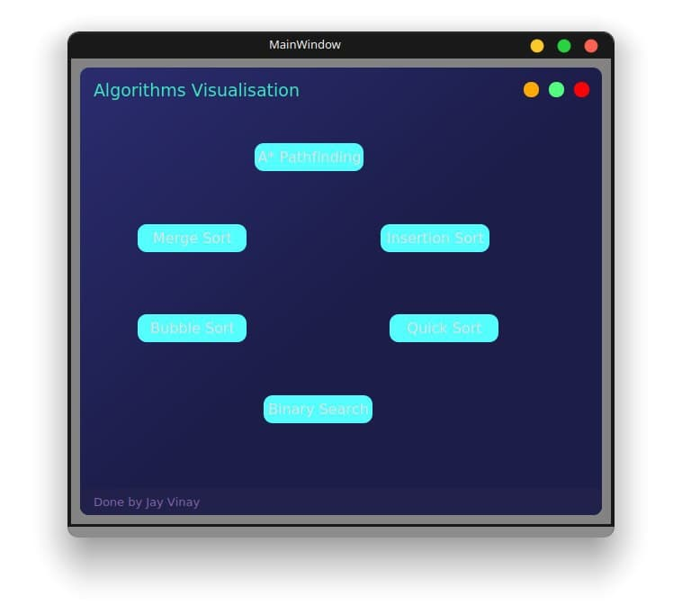
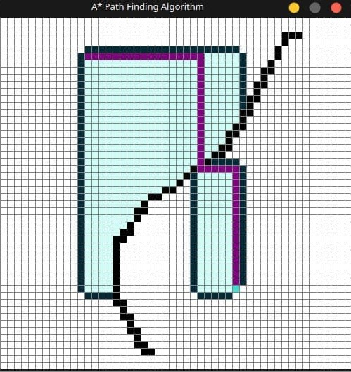
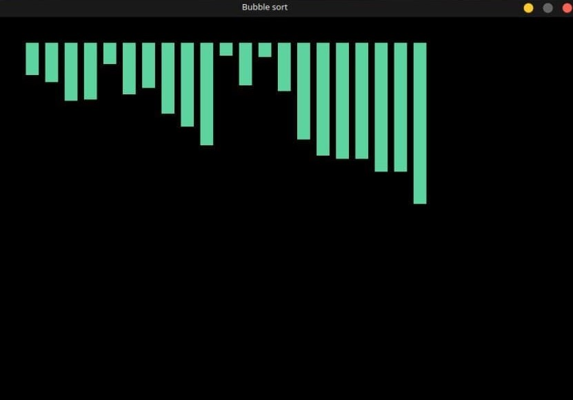
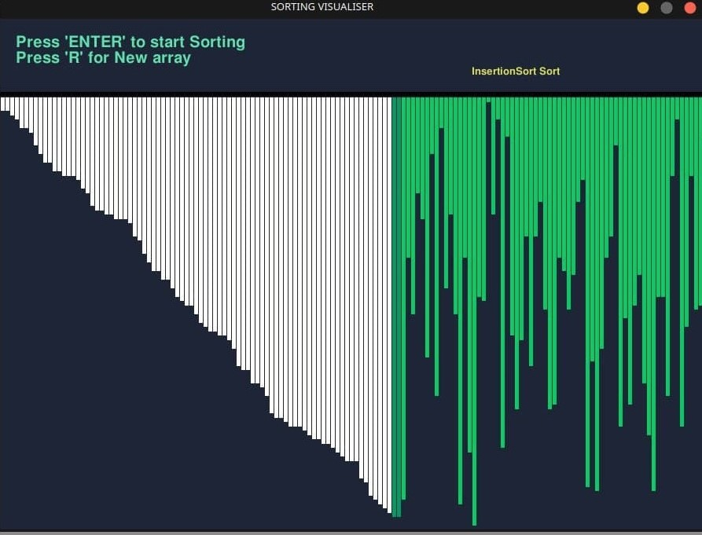
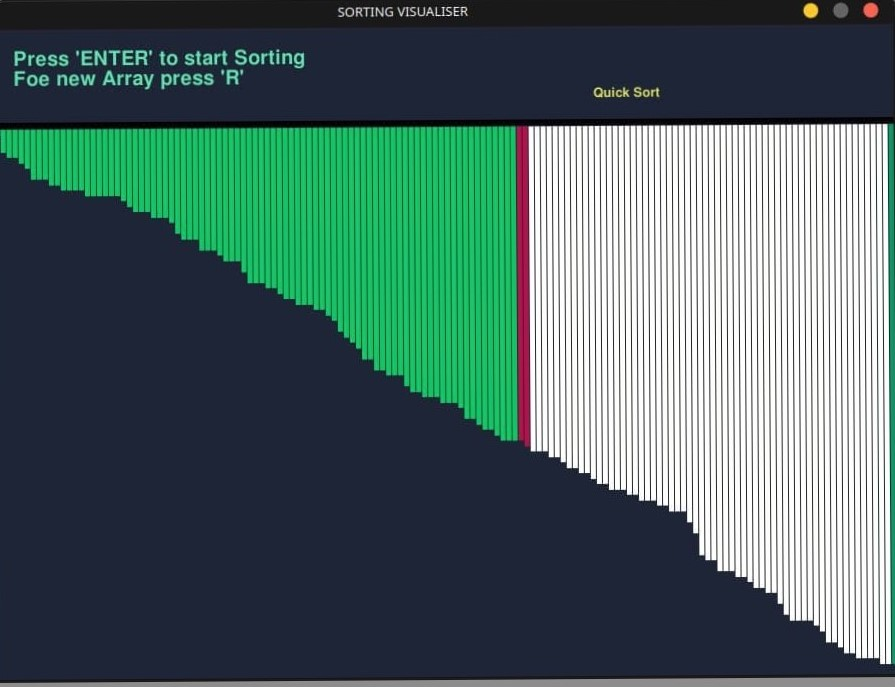

[![https://www.linkedin.com/in/jay-vinay/][linkedin-shield]][linkedin-url]


<!-- PROJECT LOGO -->
<br />
<p align="center">
  <a href="https://github.com/othneildrew/Best-README-Template">
    
  </a>

  <h3 align="center">Jays AlgorithmsVisualisationTool
</h3>

  <p align="center">
Get a clear understanding of the mentioned Algorithms by a Simple Clone and Run
Learning by Visualising is Fun
   <br />
    <a href="https://jays-algorithms-visualiser-pyqt.netlify.app/"><strong>Made with ♥ by Jay
 »</strong></a>
    
  </p>
</p>


<!-- TABLE OF CONTENTS -->
<details open="open">
  <summary>Table of Contents</summary>
  <ol>
    <li>
      <a href="#about-the-project">About The Project</a>
      <ul>
        <li><a href="#built-with">Built With</a></li>
      </ul>
    </li>
    <li>
      <a href="#getting-started">Getting Started</a>
      <ul>
        <li><a href="#installation">Installation</a></li>
      </ul>
    </li>
    <li><a href="#usage">Usage</a></li>
    <li><a href="#contributing">Developed by</a></li>
    <li><a href="#contact">Contact</a></li>

  </ol>
</details>


<!-- ABOUT THE PROJECT -->
## About The Project







A GUI Tool to visualise few algorithms

### Built With (Tools)

* [PyQt5](https://www.qt.io/)
* [PyGame](https://www.pygame.org/news)

## Following are the Algorithms used for Visualising
1.Merge Sort

2.Insertion Sort

3.Bubble Sort

4.Quick Sort

5.A* Path Finding


<!-- GETTING STARTED -->
## Getting Started

To get a local copy up and running follow these simple example steps.

### Installation

1. Extract the zip file and open the complete Directory in IDE (Pycharm prefered)
or
2. Clone the repo
   ```sh
   gh repo clone NamgiriJayVinay/JayAlgorithms-Visualizer-PyQt-
   ```
3. In the integrated terminal or commmand prompt redirect to the Project Folder and install all the required dependencies by typing below command
Wait for all the dependencies to get installed into your system
   ```sh
   pip install PyQt5
   pip install Pygame
   ```
4. Hit the command after redirecting to the following directory : JayAlgorithms-Visualizer-PyQt-/Jayinterface - v1.1/
   ```py
   python main.py
   ```


<!-- USAGE EXAMPLES -->
## Usage

This can be used for getting a clear understanding of How does an Algorithm work in a visual Manner


<!-- CONTRIBUTING -->
## Developed by
    Jay Vinay Namgiri


<!-- CONTACT -->
## Contact

Jay - [@https://www.linkedin.com/in/jay-vinay/](https://www.linkedin.com/in/jay-vinay/)

My Website - [https://www.jayvinay.com/](https://www.jayvinay.com/)


Project  Landing Page: [https://jays-algorithms-visualiser-pyqt.netlify.app/](https://jays-algorithms-visualiser-pyqt.netlify.app/)

Project  Source code Link: [https://github.com/NamgiriJayVinay/JayAlgorithms-Visualizer-PyQt-](https://github.com/NamgiriJayVinay/JayAlgorithms-Visualizer-PyQt-)


<!-- MARKDOWN LINKS & IMAGES -->
<!-- https://www.markdownguide.org/basic-syntax/#reference-style-links -->
[contributors-shield]: https://img.shields.io/github/contributors/othneildrew/Best-README-Template.svg?style=for-the-badge
[contributors-url]: https://www.jayvinay.com/

[linkedin-shield]: https://img.shields.io/badge/-LinkedIn-black.svg?style=for-the-badge&logo=linkedin&colorB=555
[linkedin-url]: https://www.linkedin.com/in/jay-vinay/
[product-screenshot]: images/ss.png
